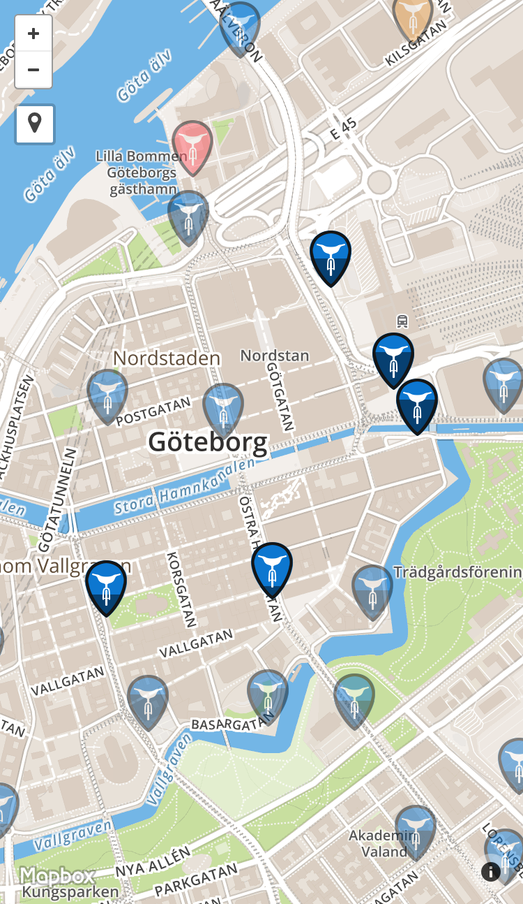

# iStället – ställ cykeln i stället istället!

A super simple web app for finding Gothenburg's city bikes, [Styr & Ställ](http://goteborgbikes.se). See [demo at istället.nu](http://istället.nu). Also available as a menu bar app.

<a href="http://istället.nu"></a>

## Features

* Provides glance-friendly station status
* Makes it possible to save favorite stations
* Updates continuously when visible
* Optionally centers around your location
* Works as a [Web Clip](https://developer.apple.com/library/ios/documentation/AppleApplications/Reference/SafariWebContent/ConfiguringWebApplications/ConfiguringWebApplications.html#//apple_ref/doc/uid/TP40002051-CH3-SW4) if you add it to your Home screen

## About

* Uses [an open API](http://data.goteborg.se/StyrOchStall/v0.1/help/operations/StyrOchStall) provided by [the City of Gothenburg](https://www.goteborg.se) under [their open data initiative](http://data.goteborg.se/)
* Built on top of [Mapbox.js](https://www.mapbox.com/mapbox.js)/[Leaflet](http://leafletjs.com)
* Uses [crossorigin.me](http://crossorigin.me) to CORS-enable the API in non-privileged environments
* Hosted with [surge.sh](https://surge.sh)

## Development

Clone and then:

```bash
npm install
grunt build
python -m SimpleHTTPServer
open http://localhost:8000/dist
```

And if you want to also build the menu bar app, you'll have to do the above and then:

```bash
npm run menubar-build
```

NB. The [consumed API](http://data.goteborg.se/StyrOchStall/v0.1/help/operations/StyrOchStall) is unfortunately not CORS-enabled, so unless you run in a privileged environment, requests will be proxied through [crossorigin.me](http://crossorigin.me) to allow this repo to be served completely staticly.

## License

MIT [http://litenjacob.mit-license.org](http://litenjacob.mit-license.org)
